 What's Complete
- [x] Introduction
- [x] Problem Formulation
- [x] Blind Search
- [x] Heuristic Search
- [x] Game Playing
- [x] Neural Networks
- [x] Machine Learning
- [x] Probabilistic Reasoning

# Introduction

## What is AI
- Broad field, with ambiguous meaning

## AI problems
1. Planning
2. Vision
3. Robotics
4. Natural Language

---

# Why do we need AI

## The travelling salesman problem
- A salesperson has to visit a number of cities
- He can start at any city and must finish at the same city
- Must visit each city only once
- Solving the TSP is equivalent to finding the minimum cost solution
### Why is the TSP so hard to solve
- Suppose we have n cities
  1. First city we have n choices
  2. Second we have (n-1) choices
  3. Thus possible number of routes stack up to n!
- A 10 city TSP has 1.8 * (10^6) possible routes
- 50 city TSP has 1.52 * (10^64) possible routes
- Need to be smart on how to solve these problems

## Big O notation `O(f(n))`
- `n` is a measure of problem size or runtime
- `f(n)` is the upper bound of the asymptotic behaviour

---

# Problem formulation
## Solving a problem by searching
- For an intelligent agent to work we need to answer the following questions:
  1. Goal to be achieved?
  2. Actions?
  3. Representation (what relevant information is necessary in order to describe the state of the world, describe available transitions, and solve the problem)

## Problem components
### Initial states
- Starting state of the problem
### Operators
- An action or set of actions that moves the problem from one state to another
- The neighbourhood is the set of all possible states reachable from one given state by applying all legal actions
- The successor function are the actions
### Goal test
- Test applied to a state which returns True if we have reached a state that solves the problem
### Path cost
- How much it costs to take a particular sequence of actions
### State space
- The initial state and the successor function define the state space which is the set of all states reachable from the initial state
- Complexity of problem dependent on state space

## Example: Romania
- Initial state: Arad
- Operator: Driving between cities
- State space consists of 20 cities in the graph
- Goal test: Bucharest
- Solution: Path from Arad to Bucharest
- Path cost: function of time/distance/risk/petrol/...

<br><br>

## State Space Representation
- We can use graphics to model the deeper structure of a problem
- A graph consits of V nodes and E edges
- Nodes
  1. Have unique label for identification
  2. Represents possible stages of a problem
- Edges
  1. Connection between two nodes
  2. Represents steps to solving a problem

## Searching the State Space
- Problem solving is the process of searching the state space for a path to the solution
- Choice of which state to expand is determined by the search strategy
- Corresponding sequences of state expansion is represented by a search tree

## Search Tree
- A tree is a graph that:
  1. Is connected but becomes disconnected on removing any edge
  2. Is connected and acyclic
  3. Has precisely one path between any two nodes (Unique paths, makes searching easier)

<br><br>

## Tree terminologies
- Nodes
  1. Root Node
  2. Child Node
  3. Parent Node
  4. Leaves
- Branching Factor
  1. Average number of children for the nodes of a tree
- Depth
  1. Number of edges from the root node
- Depth of tree
  1. Depth of deepest node

## Why goal search is not trivial
- Graph is not a nice picture
- At start of search, algorithm does not know
  1. Size of tree
  2. Shape of tree
  3. Depth of goal state

## Properties of a search
- We say a search method is complete if it has these properties:
  1. If a goal exists, the search will always find it
  2. If there is no goal, eventually the search method will stop and say for sure no goal exists

## Problem representation
### Node representation
- A node is a bookkeeping data structure.
#### State
- State which a node corresponds to in the state space
#### Parent node
- Previous node that generated this node
#### Action/Operator
- Operator applied to generate this node
#### Path cost `g(x)`
- The path cost from the initial node to this node
#### Depth
- The number of nodes from the root
#### Successor Function
- The `Successor-Fn(x)` returns all states that can be reached from state x

## How good is a solution
- Does our function actually find a solution
- Is it a good solution?
  1. Path Cost
  2. Search Cost (Time and Memory)
  3. Is the solution optimal
## Evaluation a search
#### Completeness
- Is it guaranteed to find a solution?
#### Time
- How long does it take to find a solution?
#### Space
- How much memory does it take to perform this search?
#### Optimality
- Does the search find the optimal solution when there are several solutions?

---

# Blind Searches
- Obtaining whole statespace is impractical, instead states are generated

## Search Tree
- Solution is a sequence of actions (a path) in a state space from a start to a goal state
- Search works by considering various possible sequences
- Search tree is the explicit tree generated by the search strategy
- Cost is the sum of the arc costs (cost of each edge) on the solution path
- Search tree may be infinite because of loopy or redundant paths
 
```
function Tree-Search(problem) returns a solution, or failure
    initialize the frontier using the initial state of problem
    loop do
        if the frontier is empty
            return failure
        
        choose a leaf node and remove from frontier
        
        if node contains a goal
            return the corresponding solution
        
        expand the chosen node, adding the resulting nodes to the frontier
``` 
## Avoiding repeated states
- Failure to detect repeated states can turn a solvable problem into unsolvable ones
- How to avoid, example graph-search:
  1. never generate a state generated before
  2. check for cycles
  3. must keep track of all possible states/memory(space complexity of O(b^d))

## Search strategies
- Two categories:
  1. Uninformed/blind
  2. Informed/Heuristic

## Blind searches
- Can only generate successors and distinguish between goal state from a non-goal state
- No preference during expansion, done systematically
- Search process constructs a search tree, where
  1. `root` is the initial state
  2. `leaf` nodes (fringe) are nodes discovered but not yet expanded or without successors
- The order of fringe processing characterises the different categories of search

## Search implementation
Search implementation requires two data structures:
### Fringes are set of nodes that
- have been discovered
- have not been procesed (tested for goal state and expanded)
- aka open nodes, frontier, agenda
### Explored nodes are set of nodes that
- have been discovered
- have been processed
- aka closed nodes
- process implies the completion of:
  1. testing whether they are a goal node
  2. all children have been discovered
   
## Fundamental algorithm:
1. Move nodes into "fringe" when they are discovered
2. Pick a node from the fringe to be processed in a predetermined order
3. Into the "explored" after they have been processed

## Breadth-First Strategy
- Explorers nodes nearest to root before exploring nodes further away
- Implementation: Fringe is first in first out (FIFO) queue
- New nodes are inserted at the end of the queue

<br><br>
### BFS Observations
- If there is a solution, BFS is guaranteed to find it
- If there are several solutions, then BFS always find the shallowest goal state
- If the cost of a solution is a non-decreasing function along with depth (meaning its cost always increases as you go deeper), then it will always find the cheapest solution
- Just before starting to explore level n, the queue holds all the nodes at level n-1
### BFS Evaluation
- It is complete
- It is optimal
- Time Complexity: `O(b^(d+1))` or less
- Space Complexity: `O(b^(d+1))` or less

## Depth-First Strategy
- Explores a path all the way to a leaf before backtracking and exploring another path
- Implementation: Fringe is a LIFO queue
- New nodes are inserted at the end of the queue

<br>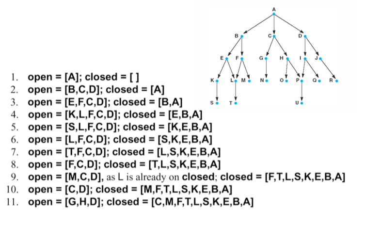<br>
### DFS Observations
- Only needs to store path from root to the leaf node and unexpanded nodes
- If DFS goes down an infinite branch, it will not terminate if it does not find a goal state
- If it does find a solution, there may be a better solution at a lower level in the tree
### DFS Evaluation
- Is is not complete
- It is not optimal
- Time Complexity: `O(b^d)`
- Space Complexity: `O(b*d)`

## Depth Limited Search
- Depth first search may never terminate as it could follow a path that has no solution and is infinite
- Depth Limited Search imposes a depth limit, at which point the search for a branch will terminate
### DLS Observations
- Can be implemented by the general search algorithm using operators which keep track of the depth
- Choice of depth parameter is important, as too deep is wasteful of time and space, while too shallow and we may never find a goal state
- If the depth parameter, l, is set deep enough, then we are guaranteed a solution if one exists
### DLS Evaluations
- Complete if l>=d where d is depth of solution
- It is not optimal
- Time Complexity: `O(b^l)`
- Space Complexity: `O(b*l)`

## Iterative Deepening Search
- On Romania, there are 20 towns so any town is reachable in 19 steps
- In fact, for Romania any town is reachable in 9 steps
- Setting a depth parameter to 19 for DFS is wasteful
- Iterative Deepening Search remedies this by choosing the depth limit by sequentially trying all depth limits until a solution is found
- In effect, combining BFS and DFS

<br>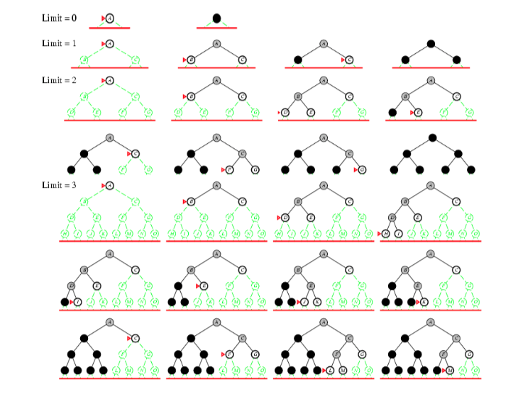<br>
### IDS Observations
- May seem wasteful as it is expanding the same nodes many times, but IDS expands just 11% more nodes than BFS or DLS when `b=10`
- For large search spaces, where the depth of the solution is not known, IDS is normally the preferred search method
### IDS Evaluation
- It is complete
- It is optimal
- Time Complexity: `O(b^d)`
- Space Complexity: `O(b*d)`

## State Space Search
- Two main approaches, data-driven and goal-driven
    #### Data-Driven Search
    - Starts from an initial state and uses actions that are allowed to move forward until a goal is reached. AKA forward chaining
    - Goal is not clear or hard to formulate precisely
    - Many possible goals
    - All or most of the data given in the initial problem statement
    #### Goal-Driven Search
    - Starts at the goal and work back torwards a start state by seeing what moves could have led to the goal state. AKA backward chaining
    - Goal can be clearly and easily formulated, example: Finding exit path from a maze, medical diagnosis
    - Problem data are not given but must be acquired by algorithm

- Both search the same state space and produce same result, however order and actual number of states searched can be different

## Uniform Cost Search
- Breadth-first search will find the optimal (shallowest) solution provided all step costs are equal
- For other cases, Uniform Cost Search (a variant of Dijkstra's Algorithm for graph search) can be used to find the cheapest solution provided that the path cost grows monotonically (i.e. never decreases as one proceeds along the path)
- Instead of expanding the shallowest node, Uniform Cost Search works by expanding the node n with the lowest path cost on the fringe
- Similar to BFS except that it sorts the nodes in the fringe according to the path cost from the start node to current node, `g(n)`
- Expands nodes until the queue's cheapest node is a goal node

## Tree Search Algorithm
```
function TreeSearch(problem, fringe) returns a solution or failure
    fringe = Insert(MakeNode(InitialState[problem]), fringe)
    loop do
        if Empty(fringe) then return failure

        node = RemoveFirst(fringe)

        if GoalTest[problem] applied to State[node] succeeds
            then return Solution(node)
        
        fringe = InsertAll(Expand(node, problem), fringe)

function Expand(previousNode, problem) returns a set of nodes
    successor = the empty set
    for <action, result> in SuccessorFn[problem](State[previousNode])
        newNode = a new Node
        State[newNode] = result
        ParentNode[newNode] = previousNode
        Action[newNode] = action
        PathCost[newNode] = PathCost[previousNode] + StepCost(previousNode, action, newNode)
        Depth[newNode] = Depth[previousNode] + 1
        add newNode to successors
    return successors
```

## Graph Search Algorithm
```
function GraphSearch(problem, fringe) returns a solution or failure
    closed = an empty set
    loop do
        if Empty(fringe) then return failure

        currentNode = RemoveFirst(fringe)

        if GoalTest[problem] applied to State[currentNode] succeeds
            then return Solution(node)

        child = the empty set

        for <action, result> in SuccessorFn[problem](State[currentNode])
            if result not in closed or fringe then
                newNode = a new Node
                State[newNode] = result
                Action[newNode] = action
                PathCost[newNode] = PathCost[previousNode] + StepCost(previousNode, action, newNode)
                Depth[newNode] = Depth[newNode] + 1
                add newNode to child
        fringe = InsertAll(child, fringe)
```

## Summary

|Evaluation|BFS    |UCS    |DFS    |DLS    |IDS    |
|:---------|:------|:------|:------|:------|:------|
|Time      |b^d    |b^d    |b^m    |b^l    |b^d    |
|Space     |b^d    |b^d    |b\*m   |b\*l   |b\*d   |
|Optimal   |Yes    |Yes    |No     |No     |Yes    |
|Complete  |Yes    |Yes    |No     |if l>=d|Yes    |
- b = Branching factor
- d = Depth of solution
- m = maximum depth of search tree
- l = depth limit

---

# Heuristic Search
- Heuristic search involves adding domain-specific information to select the best path along which to continue searching
- Sometimes known as *informed search*, it is usually more efficient than blind search
- Heuristic search works by deciding which is the next best node to expand (though it may not be the best node)

## Heuristics
- Heuristic function `h(n)` estimates the "goodness" of a node n, specifically, `h(n)` = estimated cost (or distance) of minimal cost path from n to a goal state
- All domain knowledge used in the search is encoded in `h(n)` which is computable from the current state description
- In general, `h(n) >= 0` for all nodes `n` and `h(n) = 0` implies that `n` is a goal node

## Best-First Search
- Node selected for expansion based on an evaluation function `f(n)`, which incorporates heuristics in some way
- We get different searches depending on the evaluation function`f(n)`

## Greedy Search
- Uses an evaluation function `f(n) = h(n)`, sorting nodes by increasing values of `f`
- Selects node to expand believed to be closest, (hence "greedy") to a goal node

## Greedy Search Observations
- It finds a solution without ever expanding a node that is not on the solution path
- Solution path is not optimal
- It is only concerned with short term gains
- It is possible to get stuck in an infinite loop unless mechanism for avoiding repeated states is in place

## Greedy Search Evaluation
- Not admissible (i.e. not accepted)
- It is not optimal
- It is not complete
- Time Complexity: `O(b^m)` where m is the depth of the search tree

## A* Search
- In greedy search, we kept looking at nodes closer to the goal, but we were accumulating costs as we got further from the initial state
- Our goal is not to minimize the distance from the current head of our path to the goal, rather to minimize the overall length of the path to the goal
- Let `g(n)` be the cost of the best path found so far between the initial node and `n`
- A*: `f(n) = g(n) + h(n)` where `f(n)` is the estimated total cost of path through `n` to goal
- Best-known form of best-first search
- Idea is to avoid expanding paths that are already expensive
- It is optimal and complete provided `h(n)` is admissible, i.e. `h(n)` never overestimates the cost to reach the goal

### Informedness
- For two A* heuristics, `h1` and `h2`, if `h1(n) <= h2(n)`, for all states n in the search space, we say `h2` is more informed than `h1`, or `h2` dominates `h1`
- Domination equals efficiency, meaning h2 will never expand more nodes than h1
- Hence always use h2 provided it does not over-estimate and computation time is not too large
### Generating Heuristics with Relaxed Problems
- A problem with fewer restrictions on the actions is called a relaxed problem
- The cost of an optimal solution to a relaxed problem is an admissible heuristic for the original problem
### Effective Branching Factor
- Effective branching factor is the average number of branches expanded
- Lower branching factor is usually associated with a better heursitc

---

# Game Playing and Coevolution
- The study of games, like AI is wide
- They range from games of entertainment to modelling systems involving strategic decision making

## Categorization of games through actions (moves)
1. Two players (Chess) vs Multi-players (Poker)
2. Deterministic (Chess) vs Non-deterministic (Poker), i.e., element of chance affecting actions
3. Perfect Informaton (Chess) vs Imperfect Information (Poker), i.e., whether there is knowledge of actions by opponent
4. Zero-Sum (Chess) vs Nonzero-sum (Prisoner's Dilemma), i.e., gain of one player is balanced by the lost of another player

## Coevolutionary systems
- Broadly, *coevolutionary systems* are systems with agents whose behaviour changes in response to their interaction outcomes
- Used to model real-world strategic decision-making systems

### Intelligent Strategic Decision-Making
- Problem solving tasks may involve some forms of decision-making processes
- For example: Given some inputs (chess board states), provide the appropriate outputs (legal moves)
- One is interested with an intelligent solution for strategic decision-making (game strategy) that can:
  1. Predict future outcomes (opponent's most likely moves)
  2. Take appropritate decisions given certain goals
  3. Adapt its behaviour to meet goals over a range of environments

## Game Solutions 1
- A standard **minimax** approach, which is a recursive search algorithm on the game-tree of board states from alternating moves between player and opponent
- Board state **evaluation functions** are hand-crafted with a deep-ply search for mid-games plus opening and end game databases
- In two-player sequential games, a ply is one turn taken by one of the players
- Most board games are considered solved, for example Othello, chess and Go
- A solved game is a game whose outcome (win, lose or draw) can be correctly predicted from any position, assuming both players play perfectly

## Game Solutions 2
- An alternative **evolutionary** approach
- More complex/involved evaluation functions
- Much shallower game-tree search (if any)
- Board state evaluation functions (game strategies) have to be **discovered** (learned)

## Coevolutionary Learning
- Problem solving becomes a search for the best strategy, **optimizing** representation parameters such as neural connections
- This optimization process is reformulated as a learning task
- Coevolutionary learning provides a framework based on natural processes of:
  1. Variation to generate new solutions
  2. Selection to test solutions

## Coevolutionary Learning Framework
- A typical coevolutionary system involves a generate-and-test behaviour
  1. Initialize population, `X(t=1)`
  2. Evaluate fitness through interactions (game-plays) between population members (agents)
  3. Select parents from `X(t)` based on fitness
  4. Generate offspring from parents to obtain `X(t+1)`
  5. Repeat steps 2 to 4 until a termination criteria is met
  6. Note: The iteration count `t` is termed generation and `X` is the population

## Coevolutionary Algorithm
```
function CEA(X, tstop)
    generation = 0
    Initialize population in X
    
    while generation <= tstop:
        Game plays for X
        Compute scores for the population X
        Sort X according to decreasing score sequence
        Select next generation's parent population
        Generate next generation's offspring population
```

## Coevolutionary Computation and Applications
- Application as a general form of generate-and-test search methodology:
  1. Population-based, randomly determined search algorithms where adaptation is the central process of the search mechanism
  2. Search problems in the context of optimization, learning and others
- Another application is where coevolutionary computation is used for simulation and modeling purposes

## Real-world problems: Constrains of Resources
- The tragedy of the Commons:
  1. Consider an open pasture free for all farmers
  2. A rational farmer would maximize his personal gain, for example add more cows for grazing
  3. The tragedy is that if every farmer seeks to maximize his gain, they would collectively destroy the pasture due to overgrazing
### Solution?
- Axelrod and many others earlier studied through simulation and modeling of **Prisoner's Dilemma** to understand the conditions that allow mutual cooperation to occur within a group of selfish individuals
- It is an elegant embodiment of the tension between rationality (reflected in the incenvtive of both sides to be selfish) and group rationality (reflected in the higher payoff to both sides for mutual cooperation)

## Why use coevolution to Simulate and Model
- Coevolutionary computation framework emphasizes the learning of behaviours through adaptation based on strategic interactions between competitors
- It simulates the specific conditions that lead to the learning outcomes of certain behaviours
- As an example, it has been shown that cooperative behaviours can be learned, i.e. the mechanism of **direct reciprocity** (meaning mutual exchange for benifit) modeled as repeated encounters encourages the learning of coopeartive behaviours through coevolution of IPD strategies

## Understanding Complex, Real-World Interactions
- However, complex real-world interactions rarely involve just two simple choices
- How about having more choices with intermediate cooperation levels where strategies can subtly exploit opponents?
- With coevolutionary learning, the model can be extended to similate interactions involving more choices

<br>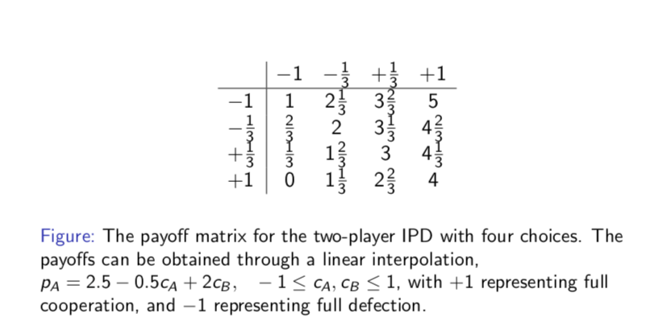<br>

## Coevolutionary Learning of Complex IPD
- Consider a large class of **deterministic** and **reactive** IPD strategies (for a wide range of complex behaviours at a level of abstraction we can analyze)
- Reactive means behavior of making a quick decision, in lower quality
- We use neural networks for strategy representation (for its scalability)
- Coevolutionary learning model:
  1. Initialize N/2 strategies
  2. Generate N/2 offspring from N/2 parents to obtain population
  3. Each strategy's fitness is assigned as the average payoffs of IPD games
  4. Select N/2 parents based on fitness values for next generation
  5. Repeat steps 1-4 for a number of generations

## More Choices lead to Defection Outcomes
- Literature has shown co-evolving cooperative strategies is difficult and requires certain conditions to be met:
  1. Minimum complexity in representation (e.g. neural networks)
  2. Behavioral diversity is needed, not genetic diversity
  3. Behavioral diversity is dependant on representation

## Why more Choices lead to Defection
- With coevolutionary learning, strategies learn behaviours through an adaptation process, which depends on the average payoff
- With more choices, it becomes difficult to resolve the intention of an intermediate play, i.e. is it a subtle **exploitation** or a signal to continue **cooperating**
- More incentives to adapt behaviours to exploit partners (for example playing lower cooperation levels to obtain higher average payoffs) when strategies cannot resolve the intention of opponents in the short-term

## One Fundamental Research Question
- Suppose I have a coevolutionary algorithm to learn game strategies, how do I know how well the co-evolved strategy performs against **new** and **unseen** opponents?
- Suppose I have a coevolutionary model to simulate an interaction, what can I say about the outcome of strategic behaviours, i.e. what behaviours are the most **robust**?

## A need for a Theoretical Framework
- For many difficult problems, we only have test cases as means to measure performance (opponents in games) of solutions
- Early attempts used empirical estimates with random samples of test cases
- Strong motivation for a theoretical framework:
  1. to establish the notion of performance and
  2. perform *rigorous quantitative analysis* in coevolutionary computation

## Generalization Performance
- Consider a game and a set `S` of `M` pure strategies `S = {1,2,3,...,M}`
- The game outcome of strategy `i` against `j` is given by `Gi(j)`
- Different definitions of `Gi(j)` indicate different quality measures
- One typical example is **win-lose**:
  ```
  Gw(i,j) = {
                Gmax for g(i,j) > g(j,i), 
                Gmin otherwise
            }
  ```
  where `Gmax > Gmin`, and `g(i,j)` is the payoff to `i` in a game against `j` 
- Note: This just basically describing a game where you can only either win or lose
- Selection of individual test strategies represented by a random variable J taking on values j (which is an element of set S) with probability `Ps(j)`
- True generalization performance of strategy i, `Gi`:
  where `Gi` is the mean of the random variable `Gi(j)`
  <br>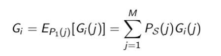<br>

## Estimated Generalization Performance
- In practice, we **estimate** the generalization performance `Gi` through a random sample `Sn` of `n` test strategies which are drawn independently and identically distributed from `S` with probability `Ps`
  <br>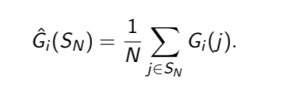<br>
  Notes:
  1. We are unable or cannot calculate `Gi`
  2. We also cannot calculate the error `|Ĝi - Gi|`

## How accurate is the Estimate?
- We make a **statistical claim** as to the **confidence (probability)** with the accuracy (**precision**) of the estimate for a sample size `N` using **Chebyshev's bounds**
- From Chebychev's Theorem, we obtain
  <br>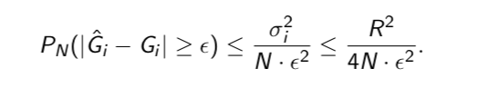<br>
  for any positive `ε > 0`
- Since random variable `Gi(J)` varies within finite interval [`Gmin`, `Gmax`] of size R, its variance is upperbounded by `(σ^2)max = R^2/4`

## Chebychev's Theorem (Chebychev's Inequality)
- In probability theory, Chebyshev's inequality guarantees that for a wide class of probability distributions, no more than a certain fraction of values can be more than a certain distance from the mean
- Specifically, no more than `1/k^2` of the distribution's values can be more than `k` standard deviations away from the mean (or equivalently, at least `1 − 1/k^2` of the distribution's values are within `k` standard deviations of the mean)
- The inequality has great utility because it can be applied to any probability distribution in which the mean and variance are defined

## Chebychev's Bound
- Chebyshev’s bounds can be restated into another more useful form
- Let `IDn| = |Ĝi − Gi|`, `IDn|′= IDn|/R`, `ε′= ε/R` Then:
  <br>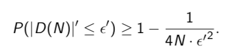<br>
  Note: The analysis can be extended to games with probabilistic strategies as well since `D(N)` is a random variable

## How useful is the Framework?
- Chebyshev's bounds are:
  1. Independent of the complexity of the game (only sample size N matters)
  2. Independent of the learning algorithms (distribution-free, e.g. can be used to estimate the performance for any strategy in any game)

## Estimations Stable in terms of Varying `Sn` Sizes
- Empirical results for 50 strategies i:
  <br>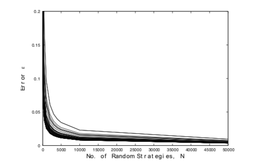<br>
- There is a trade-off (around N = 2000) between improving estimates and computational cost is roughly the same for most of the strategies
### Why estimation stable?
1. Game outcome is a random variable `Gi(J)` with finite mean and variance
2. `Sn` is drawn independently and identically distributed to compute generalization estimates `Ĝ(Sn)` (that takes the sum `Gi(1)`+···+`Gi(N)`)
3. `Ĝi(Sn)` is realization of a random variable
4. By Central Limit Theorem, `Ĝi(Sn)` is Gaussian-distributed for large enough N

## Generalization Performance in Coevolutionary Learning
1. Generation step, t = 1: Initialize POPSIZE/2 parent strategies, `Pi`, `i = 1, 2, ..., POPSIZE/2` randomly
2. Generate POPSIZE/2 offspring, `Oi` , `i = 1, 2, ..., POPSIZE/2`, from `POPSIZE/2` parents using a variation
3. All pairs of strategies compete, including the pair where a strategy plays itself (i.e., round-robin tournament)
4. For `POPSIZE` strategies in a population, every strategy competes a total of `POPSIZE` games
5. Select the best `POPSIZE/2` strategies based on total payoffs of all games played. Increment generation step, `t = t + 1`
6. Step 2 to 4 are repeated until termination criterion (i.e., affixed number of generation) is met

## Strategy Representation
|   |+1 |-1 |
|---|---|---|
| +1|m11|m12|
| -1|m21|m22|
- The direct look-up table representation provides one-to-one mapping (strategy representation and behavior) for deterministic and reactive memory-one PD strategies
- `Mfm` used to represent the first move directly when there is no prior history played yet

## TLDR
We have to:
  1. Have an appropriate number of games, `N`
  2. Have a proper game setup, i.e. proper number of choices
to get a proper coevolutionary learning framework

---

# Neural Networks

## What is a neural network
- An interconnected assembly of simple processing elements, **units** or **nodes**, whose functionality is loosely based on the **animal neuron**
- The processing ability of the network is stored in inter-unit connection strengths, or **weights**
- These weights are obtained by a process of adaptation to, or learning from, a set of training patterns

## Biological Neural Networks
- We are born with about 100 billion neurons
- A neuron may connect to as many as 100 thousand other neurons
- Signals "**move**" via complex electrochemical reactions
- The synapses release a chemical transmitter, in which the sum can cause a threshold to be reached, causing the neuron to "**fire**"

## Modeling a Neuron
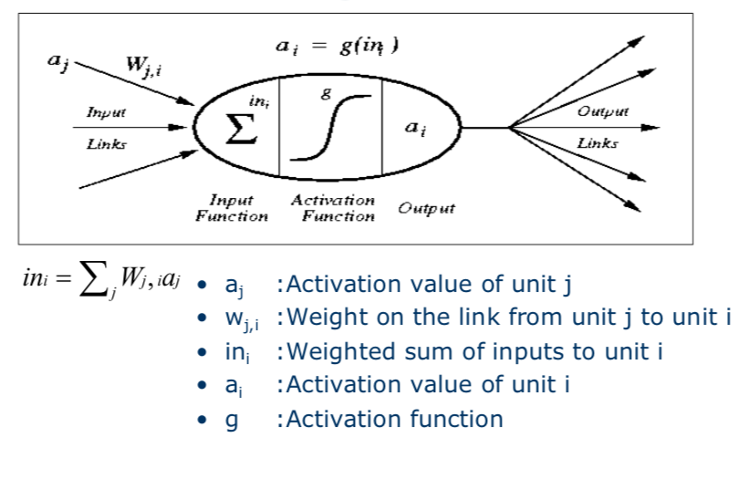

## Activation Functions
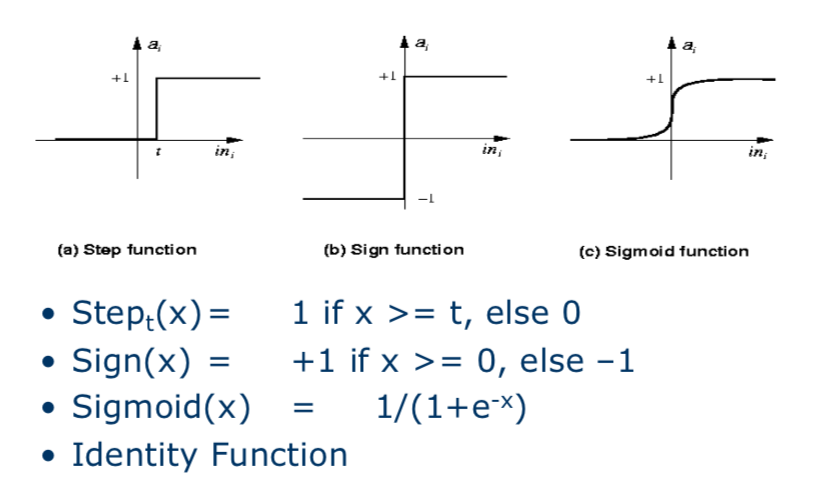

## Simple Networks
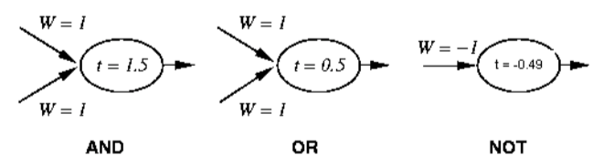
- `W` = Weights
- `t` = Threshold, subtract this from the weighted sum

## Perceptron
- In machine learning, the perceptron is an algorithm for supervised learning of binary classifiers
- A binary classifier is a function which can decide whether or not an input, represented by a vector of numbers, belongs to some specific class
- A single weight only affects one output
- Thus, we can restrict our investigations for each perceptron
### What can Perceptrons Represent
- Only functions which are linearly seperable can by represented by a perceptron
- The dimensionality of function space is equal to the number of inputs, which will typically be higher than 2
- Seperation in this case is by a hyperplane of (dimensionality-1)
#### Linear Seperability
- Linear separability is a property of two sets of points
- This is most easily visualized in two dimensions by thinking of one set of points as being colored blue and the other set of points as being colored red
- These two sets are linearly separable if there exists at least one line in the plane with all of the blue points on one side of the line and all the red points on the other side
- Linear Separability is also possible in more than 3 dimensions, but it is harder to visualise
#### Hyperplane
- In geometry, a hyperplane is a subspace whose dimension is one less than that of its ambient space
- If a space is 3-dimensional then its hyperplanes are the 2-dimensional planes, while if the space is 2-dimensional, its hyperplanes are the 1-dimensional lines
- In machine learning, hyperplanes are a key tool to create support vector machines for such tasks as computer vision and natural language processing

## Learning
```
While epoch produces an error
    Present network with next inputs from epoch
    Err = T-O
    If |Err| > 0 Then
        Wj = Wj + LR * Ij * Err
```
### Epoch
- Presentation of the entire training set to the neural network
- In the case of an `AND` function an epoch consists of four sets of inputs i.e. `[0,0]`, `[0,1]`, `[1,0]` and `[1,1]`
### Training Value, `T`
- When we are training a network we not only present it with the input but also with a value that we require the network to produce
- For example, if we present the network with `[1,1]` for the `AND` function the training value will be `1`
#### Output from Neuron, `O`
- The output value from the neuron
#### `Ij`
- Inputs being presented to the neuron
#### `Wj`
- Weight from input neuron `Ij` to the output neuron
#### `LR`
- The learning rate
- It dictates how quickly the network converges
- Set by a matter of experimentation
- Typically 0.1
#### `Err`
- Amount by which the value output by the network differs from the training value
- For example, if we required the network to output 0 and it output 1 instead, then Err = -1

### Example of a Peceptron
- A perceptron with two inputs, is to learn the AND function below:

  |X1   |X2   |T    |
  |:----|:----|:----|
  |0    |0    |0    |
  |1    |0    |0    |
  |0    |1    |0    |
  |1    |1    |1    |

- Let `α = 0.25` be the learning rate, initial weights and threshold be 0, 0.4 and 0.3 respectively, `T` the training output and `O` the actual output, the weights and threshold should be adjusted as below:<br>
1. `δwi = α(T-O)Ii` where `Ii` is the input and is always equal to -1 for the threshold
2. `δθ = -α(T-O)`

Where
1. `a = Σi(wi * xi)` 
2. `0 = threshold`

## Building a Neural Network
- There are many forms of neural networks 
- Most operate by passing neural 'activations' through a network of connected neurons
- The select structure designs the way that neurons are interconnected
- Three main classes of network architectures
  1. Single-layer feed-forward (acyclic)
  2. Multi-layer feed-forward (acyclic)
  3. Recurrent

---

# Machine Learning

## What is Machine Learning?
- A computer program is said to learn from experience `E` with respect to some class of tasks `T` and performance measure `P` if its performance at tasks in `T`, as measured by `P`, improves with experience `E`
- The world is driven by data:
  1. Google processes 24 petabytes per day
  2. Data in 2013 > all data in history
  3. Powerful, cheaper computers and cloud storage make data accessible
- Many applications are hard to program directly but most are "pattern recognition" tasks (e.g. targeted advertising, reading handwritting)
- Machine learning collect lots of "training data" (examples) that specify the correct output for a given set of inputs
- A machine learning algorithm then takes these examples and produces a program that does the job (learning from examples)

## Machine Learning vs Traditional Programming
- In traditional programming, a computer takes in a data and uses a program to generate an output
- In machine learning, a computer takes in data and outputs to generate a program

## Machine Learning Problems
- Amount of knowledge might be too large for explicit encoding by humans
- Human expertise may be scrace or costly
- Black box human expertise that cannot be explained, and functional relationships cannot be expressed mathematically
- Rapidly changing phenomena
- Need for customisation/personalisation
- Often only data from measurements are available

## How Machine Learning Works
### Training
- Given a *training set* of labeled examples `{(x1, y1), ..., (xn, yn)}`, the function f is estimated by minimising the prediction error on the training set
- Training set may be noisy, e.g. `(x, (f(x) + ε))`
### Testing
- Apply `f` to a never seen before test example `x` and output the predicted value `y = f(x)`

## Machine Learning Tasks
### Supervised
- Given input samples `x` and labeled outputs `y` of a function `y = f(x)`, "learn" `f` and evaluate it on new data
  1. Classification: `y` is discrete (class labels). Learn a decision boundary that seperates one class from another
  2. Regression: `y` is continuous, e.g. linear regression. Learning a continuous input-output mapping, also known as "curve fitting" and "function approximation"
- Examples:
  1. Is this image a cat, dog, car or house?
  2. How would this user score that restaurant?
  3. What will be the sales, stock price next year?
### Unsupervised
- Gives only samples `x` of the data, infers a function `f` such that `y = f(x)` descirbes the hidden structure of the unlabeled data
- More of an exploratory/descriptive data analysis
  1. Clustering: `y` is discrete. Learn any intrinsic structure that is present in the data
  2. Dimensional Reduction: `y` is continuous. Discover a lower-dimensional surface on which the data lives
- Examples:
  1. Cluster some hand-written digit data into 10 classes
  2. What are the top 20 topics in Twitter right now?
  3. Discover interesting relations between variables in large databases
### Supervised vs Unsupervised Learning
|Supervised                                           |Unsupervised             |
|:----------------------------------------------------|:------------------------|
|`y = F(x)`: function                                 |`y = ?`: no function     |
|`D`: labeled training set                            |`D`: unlabeled dataset   |
|`Learn`: model trained to predict labels of new cases|`Learn`: ?               |
|`Goal`: `E[(F(x)- G(x))^2] = 0`                      |`Goal`: ?                |

## Classification
- Learn a method for predicting the instance class from pre-labeled (classified) instances
- Many approaches:
  1. Nearest Neighbour
  2. Regression
  3. Decision Trees
  4. Bayesian
  5. Neural Networks

### Nearest Neightbour
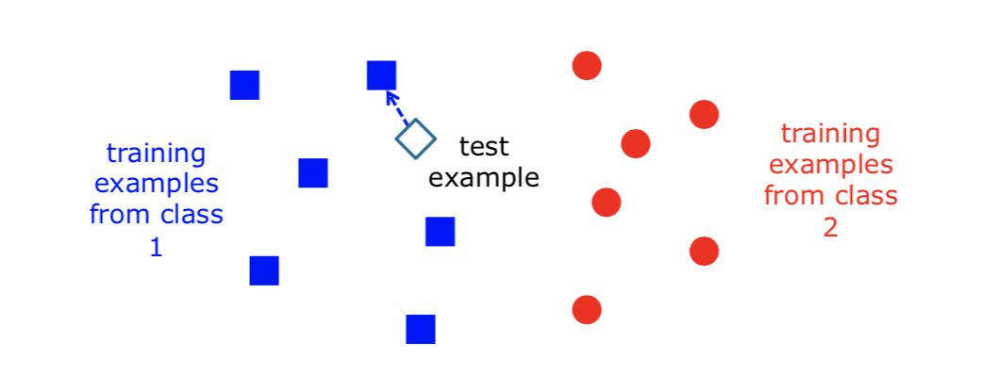
- The test sample `x` will be classified as belonging to the same class as `f(x1)`, i.e. label of the training example nearest to `x`
- All we need is a distance function for the input
- No training required
- Also known as instance-based learning

### k-Nearest Neighbour
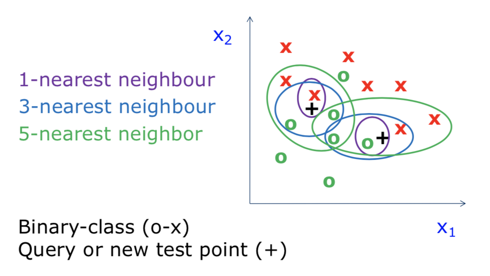
- The data is the model
  1. No training needed
  2. Accuracy generally improves with more data
  3. Matching is simple and fast (and single pass)
  4. Usually needs data in memory, but can be run off disk
- Minimal configuration, only parameter is k (number of neighbours)
- Two other choices are important:
  1. weighting of neighbours (e.g. inverse distance)
  2. similarity metric 

### Regression
- To find the best line (linear function `y = f(x)`) to explain the data
- Assuming a linear or nonlinear model of dependency
- Used for:
  1. predict sales of new products based on advertising expenditure
  2. time series prediction of stock market indices
  3. estimated weight based on BMI
- Not flexible enough

### Decision Trees
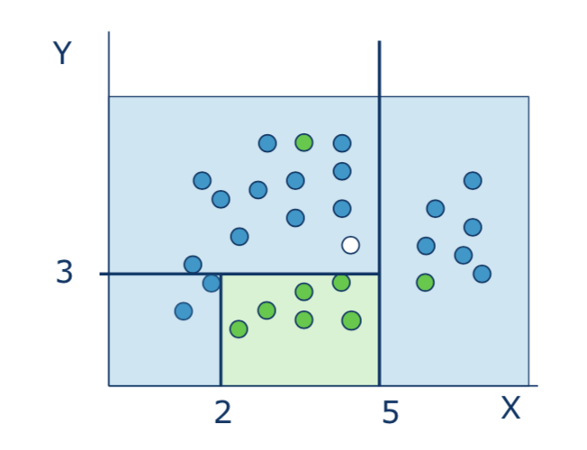
```
if X > 5 then blue
else if Y > 3 then blue
else if X > 2 then green
else blue
```
- A decision tree is a flowchart-like structure in which each internal node represents a "test" on an attribute (e.g. whether a coin flip comes up heads or tails)
- Each branch represents the outcome of the test
- Each leaf node represents a class label (decision taken after computing all attributes)
- The paths from root to leaf represent classification rules

|Pros                                 |Cons                                  |
|:------------------------------------|:-------------------------------------|
|Reasonable training time             |Simple decision boundaries            |
|Can handle large number of attributes|Problems with lots of missing data    |
|Easy to implement                    |Can't handle complicated relationships|
|Easy to interpret                    |                                      |

### Neural Networks
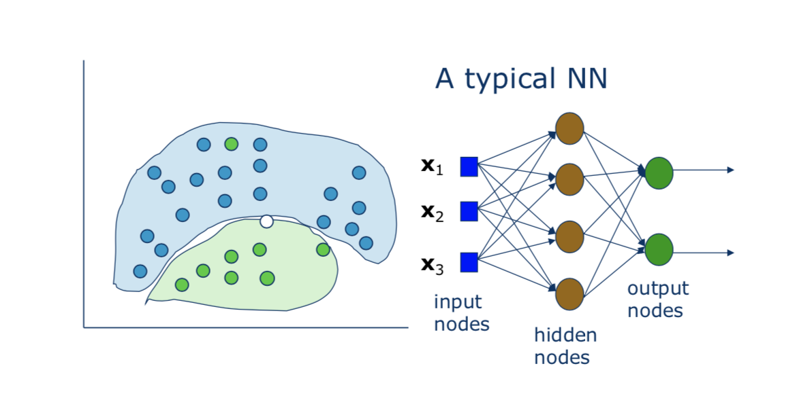
- Useful for learning complex data like speech, image and handwriting recognition
- Regression: use of linear or any other polynomial
- Decision Trees: divide decision space into piecewise regions
- Neural Networks: partition by nonlinear boundaries

|Pros                                       |Cons                                                                            |
|:------------------------------------------|:-------------------------------------------------------------------------------|
|Can learn more complicated class boundaries|Hard to implement: Trial and error for choosing parameters and network structure|
|Can be more accurate                       |Slow training time                                                              |
|Can handle large number of features        |Can over-fit the data: find patterns in random noise                            |
|                                           |Hard to interpret                                                               |

## Applications of classification
- Banking: predict good customers based on old customers
- Fraud detection: use historical data to build models of fradulent behaviour and use data mining to help identify similar instances
- Customer relationship management (CRM)

## Clustering
- What we have
  1. a set of unlabeled data points, each with a set of attributes
  2. a similarity measure
- What we need to do
  1. Find "natural partitioning of data, or groups of similar/close items
- Key: measure of similarity between instances
  1. Euclidean or Manhattan distance
  2. Hamming distance
  3. Other problem specific measures

## Generalisation
- How well does a learned model generalise from the data it was trained on to a new test set?
- Components of generalisation error
  1. Inherent: meaning unavoidable
  2. Bias: How much the average model over all training sets differ from the true model? High bias makes the model miss relevant data
  3. Variance: How much models estimated from different training sets differ from each other? High variance causes the algorithm to model the noise
#### Underfitting
- Model is too "simple" to represent all the relevant class characteristics
- High bias and low variance
- High training error and high test error
#### Overfitting
- Model is too "complex" and fits irrelevant characteristics (noise) in the data
- Low bias and high variance
- Low training error and high test error

## Bias-Variance Trade-off
- Models with too few parameters are inaccurate because of a large bias (not enough flexibility)
- Models with too many parameters are innacurate because of a large variance (too much sensitivity to the sample)

## How Overfitting affects Prediction
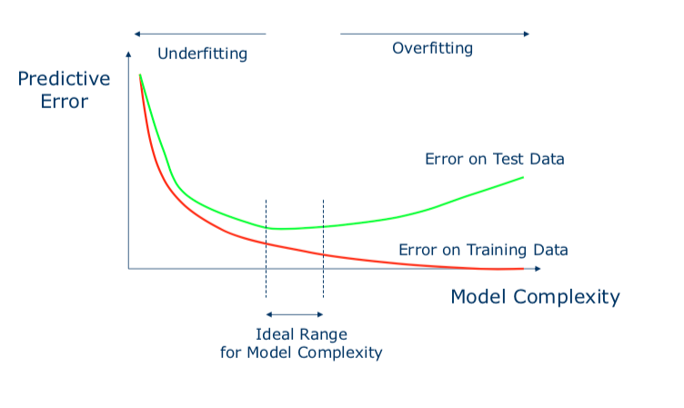

## The Holdout Method
- Randomly split examples into training set `U` and test set `V`
- Use training set `H` to learn a hypothesis `H`
- Measure % of `V` correctly classified by `H`
- The hold-out method splits the data into training data and test data
- Repeated holdout method repeats the process with different subsamples
  1. In each iteration, a certain proportion is randomly selected for training
  2. The error rates on the different iterations are averaged to yield an overall error rate

## The v-fold Cross-Validation Method
- Why just choose one particular 90/10 “split” of the data? 
- In principle we could do this multiple times
- Randomly partition our full dataset into **v disjoint subsets** (each roughly of size `n/v`, `n` = total number of training data points)
```
// v = 10
for i in range(10)
    train on 90% of data,
    Acc(i) = accuracy on other 10%
```
- Cross-Validation-Accuracy = `1/v * (sum of all Acc(i))`
- Choose the method with the highest cross-validation accuracy
- Common values for v are 5 and 10
- Can also do "leave-one-out" where `v = n`

---

# Probabilistic Reasoning

## Basic Concepts
- A probability space `(S,F,P)` is a model for some real-world situations
- `(S,F,P)` is defined by:
  1. space `S`: the set of all possible outcome
  2. σ-algrebra `F`: the set of all events `A` (subset of `S`), e.g. power set `2^s`
  3. probabilities `P(A)` assigned to events `A`s
- Consider an experiment involving a single coin-flip with head `H` and tail `T`
  1. `S` = `(H, T)`
  2. `F` = `(H, T)` 
  3. `P(H)` = `P(T)` = `0.5` (assuming fair coin) 
  4. Note here `F` ⊂ `2^s` = `{{}, H, T, {H, T}}`

## Disjoint probability
- Two events are disjoint if they have no outcome in common: `P(A v B) = P(A) + P(B)`
- Events `A` and `B` are disjoint. Events `A` and `B` cannot both occur at the same time, so there is no overlapping:<br>
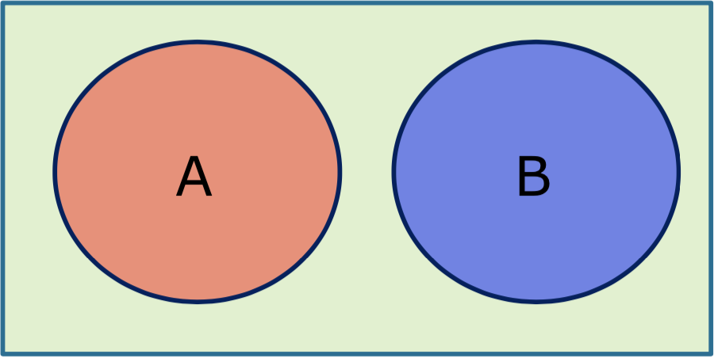
- The chance of any (one or more) of two or more events occurring is called the union of the events
- A single fair coin-flip’s outcome is either `H` or `T`, so `P(H ∨ T)` = `P(H)` + `P(T)` = `1`
- If two probabilities are joint however, `P(A v B)` = `P(A)` + `P(B)` - `P(A^B)`

## Probability Independence
- If two events `A` and `B` are independent, then the probability of both events happening is the product of the probabilities for each event: 
  1. `P(A ∧ B)` = `P(A)P(B)`
  2. `P(A|B)` = `P(A)`
  3. `P(B|A)` = `P(B)`
- If two events `A` and `B` are not disjoint, then the probability of their union (the event that A or B occurs) is equal to the sum of their probabilities minus the sum of their intersection: `P(A v B) = P(A) + P(B) - P(A ^ B)`

## Marginalising
- `P(B)` = `Σa P(B,A)`
- `P(B)` = `Σa P(B|A)P(A)` (conditioning)

## Bayes' Theorem
- Product Rule: `P(X,Y)` = `P(Y|X)P(X)`
- Together with the symmetry property `P(X,Y)` = `P(Y,X)`, the relationship between conditional probabilities can be derived, known as Bayes' theorem:
- `P(Y|X)P(X)` = `P(X|Y)P(Y)`
- Using the sum rule, the denominator can be expressed in terms of the quantities appearing in the numerator:
- `P(X)` = `Σy P(X|Y)P(Y)` (see marginalising)

## Prior Probability
- Degree of belief without any evidence, for example:
  1. Just `P(X)`
  2. Or just `P(Y)`

## Joint Probability
- Matrix of combined probabilities of a set of variables

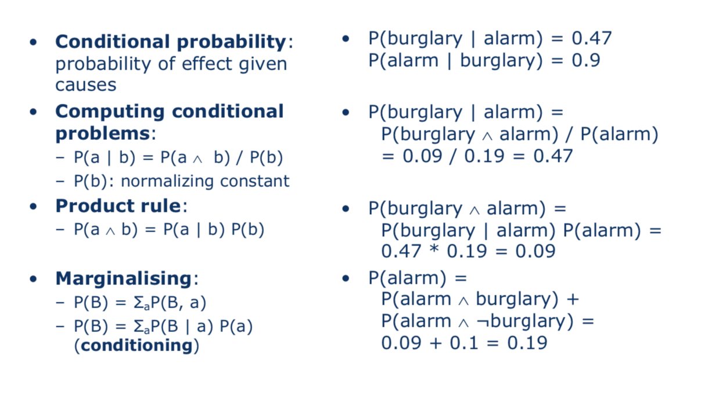

## Conditional Independence
- Variables `A` and `B` are conditionally independent given `C` if any of the following hold:
- `P((A,B)|C)` = `P(A|C)P(B|C)`
- `P((A|B),C)` = `P(A|C)`
- `P((B|A),C)` = `P(B|C)`
- Note: Conditional Independence does not imply Probability Independence
 
## Bayes' Rule
- Bayes’ rule is derived from the product rule:
- `P(Y|X)` = `P(X|Y)P(Y)/P(X)`
- commonly expressed as `P(H/E)` = `P(E/H)P(H) / P(E)` where
  1. `P(H/E)` is the probability that `H` is true given evidence `E`
  2. `P(E/H)` is the probability that we will observe `E` given `H`
  3. `P(H)` is the a prior probability that the hypothesis `H` is true in the absence of any specific evidence.
- This rule is often useful for diagnosis
- Example of bayes' rule for medical diagnosis:<br>
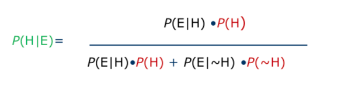
### Bayer's Rule general form
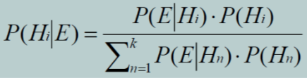

## Choosing Hypotheses
- Generally want the most probable hypothesis given the training data
- Maximum of a posterior hypothesis Hmap:

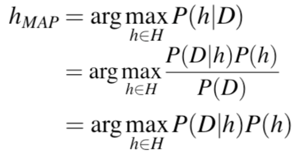
- `P(h)` = prior probability of hypothesis `h`
- `P(D)` = prior probability of training data `D` 
- `P(h|D)` = probability of `h` given `D`
- `P(D|h)` = probability of `D` given `h`

## Naive Bayes Classifiers
- In machine learning, naive Bayes classifiers are a family of simple "probabilistic classifiers" based on applying Bayes' theorem with strong (naive) independence assumptions between the features